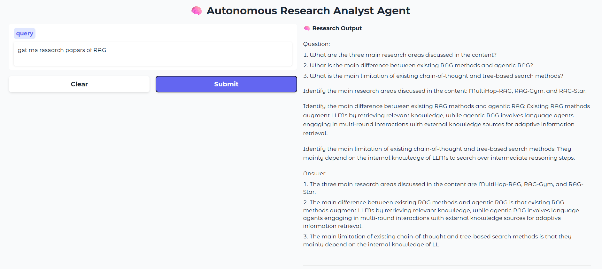

# 🧠 Autonomous Research Agent

A production-style **LLM-powered research agent** built with LangGraph that can **route queries, retrieve knowledge, reason over data, critique outputs, and maintain memory**.

---

## 🚀 Overview

This project implements a **multi-stage AI agent pipeline** that mimics how a human researcher works:

* Understand the query
* Route it to the appropriate reasoning strategy
* Retrieve relevant knowledge (ArXiv or fallback)
* Generate structured insights using an LLM
* Critique the output quality
* Store useful knowledge for future use

---

## 🏗️ Architecture

```text
User Query
   ↓
Router
   ↓
Retriever (ArXiv / Fallback Knowledge)
   ↓
LLM Reasoning (Compare / Summarize)
   ↓
Critic
   ↓
Memory Update
   ↓
Final Response (Gradio UI)
```

---

## 📂 Project Structure

```text
autonomous-research-agent/
│
├── app.py                 # Entry point (Gradio UI)
├── requirements.txt
├── README.md
│
├── agent/
│   ├── state.py           # Agent state definition
│   ├── router.py          # Query routing logic
│   ├── retriever.py       # ArXiv retrieval + fallback
│   ├── llm.py             # LLM loading (Phi-2)
│   ├── nodes.py           # Reasoning (compare/summarize)
│   ├── critic.py          # Output evaluation
│   ├── memory.py          # Memory store
│   ├── utils.py           # Helpers (cache, logging)
│   └── workflow.py        # LangGraph pipeline
│
├── assets/
│   └── screenshot.png
```

---

## ⚙️ Features

* 🔀 **Dynamic Query Routing**

  * Compare queries → structured comparison
  * Research queries → retrieval + summarization
  * General queries → deep reasoning

* 📄 **Research Retrieval**

  * Integrated with ArXiv API
  * Fallback to conceptual knowledge when needed

* 🧠 **LLM Reasoning**

  * Structured outputs (compare, summarize)
  * Prompt-engineered for consistency

* 🔍 **Critique Layer**

  * Evaluates structure and quality of responses

* 💾 **Memory System**

  * Stores past queries and summaries
  * Enables contextual reuse

* ⚡ **Caching**

  * LLM response caching
  * Retrieval caching

* 🖥️ **Interactive UI**

  * Built with Gradio
  * Real-time response display

---

## 🧪 Example

### Query

```text
Compare RAG and GraphRAG
```

### Output

```text
Key Differences:
- RAG retrieves documents; GraphRAG uses graph traversal
- GraphRAG enables multi-hop reasoning

Strengths:
- RAG: Simple and scalable
- GraphRAG: Better contextual understanding

Weaknesses:
- RAG: Limited reasoning depth
- GraphRAG: Higher complexity

Use Cases:
- RAG: QA systems
- GraphRAG: Enterprise knowledge systems
```

---

## 🛠️ Tech Stack

* **LLM**: microsoft/phi-2
* **Framework**: LangGraph
* **Orchestration**: LangChain
* **Retrieval**: ArXiv API
* **UI**: Gradio
* **Backend**: Python

---

## ⚡ Setup

### 1. Clone the repository

```bash
git clone https://github.com/leoevenss/autonomous-research-agent.git
cd autonomous-research-agent
```

### 2. Install dependencies

```bash
pip install -r requirements.txt
```

### 3. Run the application

```bash
python app.py
```
---

## 📊 Design Highlights

* Modular and extensible architecture
* Clear separation of concerns
* Stateful agent execution via LangGraph
* Pluggable LLM backend
* Robust fallback mechanisms

---

## 🚧 Limitations

* Small LLM (Phi-2) may struggle with complex reasoning
* In-memory storage (no persistence)
* Limited retrieval depth (top-k results)

---

## 🔮 Future Work

* GraphRAG integration (knowledge graphs)
* Vector database (FAISS / Pinecone)
* Streaming responses
* Multi-agent collaboration
* Persistent memory layer

---

## 🖥️ Demo



---

## 🤝 Contributing

Contributions are welcome! Feel free to open issues or submit pull requests.

---

## ⭐ If you found this useful

Consider giving the repo a star ⭐
